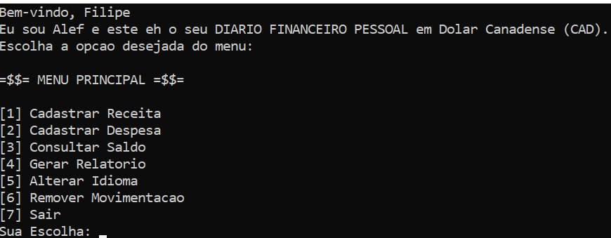

# 💰 Diário Financeiro Pessoal

## 🏆 Sobre o Projeto
O Diário Financeiro Pessoal é uma aplicação de console desenvolvida em C para o gerenciamento de finanças pessoais. O sistema permite o registro de receitas e despesas, o cálculo do saldo atualizado e a geração de relatórios detalhados sobre a movimentação financeira diária e mensal. Com suporte a múltiplos idiomas (Português, Inglês e Francês - Canadá), o Diário Financeiro Pessoal oferece uma interface simples, eficiente e prática para facilitar o controle das finanças pessoais.

**Repositório do Código:** https://github.com/johnatanwillow/diario_financeiro

## 🎯 Objetivos do Projeto
* Auxiliar o usuário no controle de suas finanças pessoais.
* Permitir o registro de receitas e despesas, o cálculo do saldo atualizado e a geração de relatórios detalhados.
* Garantir a persistência dos dados, assegurando que todas as informações sejam salvas e carregadas automaticamente.
* Proporcionar uma experiência intuitiva e multilíngue.

## 🛠 Funcionalidades Principais
* **Cadastro de Receitas e Despesas:** Permite solicitar e registrar transações, incluindo data, tipo (receita/despesa), valor, descrição e categoria.
* **Consulta de Saldo Atualizado:** Calcula o saldo financeiro total e exibe as metas, se existirem.
* **Geração de Relatórios:** Oferece opções para visualizar transações por dia, mês, ou um relatório geral, além de um gráfico de fluxo de caixa em formato ASCII.
    * **Geral:** Lista todas as transações registradas.
    * **Diário:** Filtra transações por dia específico.
    * **Mensal:** Mostra as transações de um mês e ano escolhidos.
    * **Gráfico de Fluxo de Caixa (ASCII):** Gera um gráfico simplificado utilizando caracteres ASCII no console, mostrando visualmente as proporções de receitas, despesas e saldo total.
* **Definição de Metas Financeiras:** Permite definir ou atualizar uma meta financeira, exibindo seu nome, valor e o progresso em relação ao saldo atual com uma barra de progresso visual.
* **Remoção de Transações:** Localiza e remove uma transação específica com base na sua descrição.
* **Suporte a Múltiplos Idiomas:** Permite alternar a interface do usuário entre Português (Brasil), Francês (Canadá) e Inglês (Canadá).
* **Persistência de Dados:** Todas as transações financeiras e a meta financeira são armazenadas em um arquivo binário (`alef.bin`), garantindo que os dados sejam preservados após o encerramento do programa. O sistema carrega automaticamente os dados do arquivo ao ser iniciado.

## 📜 Fluxo de Funcionamento
O programa segue um fluxo de trabalho intuitivo, guiado por um menu principal.

[1] Cadastrar Receita
[2] Cadastrar Despesa
[3] Consultar Saldo
[4] Gerar Relatório
[5] Alterar Idioma
[6] Remover Movimentação
[7] Sair
## 📌 Exemplo Simplificado do Fluxo

Snippet de código

A[Início do Programa] --> B{Carregar Movimentações e Meta (alef.bin)};
    B --> C{Exibir Boas-vindas};

    C --> D{Loop Principal do Menu};

    D --> E{Exibir Menu Principal};
    E --> F{Usuário Insere Opção};

    F --> G{Leitura Válida?};
    G -- Não --> H[Opção Inválida];
    H --> D;

    G -- Sim --> I{Qual a Opção?};

    I -- Opção 1: Cadastrar Receita --> J[Gerenciar Cadastro de Movimentação ('R')];
    I -- Opção 2: Cadastrar Despesa --> K[Gerenciar Cadastro de Movimentação ('D')];
    J --> L{Sucesso no Cadastro?};
    K --> L;
    L -- Sim --> M[Inserir Movimentação];
    L -- Não --> D;
    M --> N{Continuar Cadastrando?};
    N -- Sim --> J;
    N -- Não --> D;

    I -- Opção 3: Consultar Saldo --> O[Gerenciar Saldo e Meta];
    O --> D;

    I -- Opção 4: Gerar Relatório --> P[Menu de Relatórios];
    P --> Q{Usuário Escolhe Tipo de Relatório};
    Q -- Geral --> R[Imprimir Movimentações (Geral)];
    Q -- Diário --> S[Ler Data com Validação (dia/mês/ano)];
    Q -- Mensal --> T[Ler Data com Validação (mês/ano)];
    Q -- Gráfico Fluxo de Caixa --> U[Imprimir Gráfico de Fluxo de Caixa];

    R --> V[Pausar Execução];
    S --> W{Data Válida?};
    W -- Sim --> X[Imprimir Movimentações (Diária)];
    W -- Não --> V;
    X --> V;

    T --> Y{Data Válida?};
    Y -- Sim --> Z[Imprimir Movimentações (Mensal)];
    Y -- Não --> V;
    Z --> V;

    U --> V;
    V --> P;
    Q -- Voltar ao Menu Principal --> D;

    I -- Opção 5: Alterar Idioma --> AA[Alterar Idioma];
    AA --> AB{Idioma FR ou EN?};
    AB -- Sim --> AC{Exibir Menu Consentimento Dados?};
    AC -- Sim --> AD{Consentimento Dado?};
    AD -- Não --> AE[Sair do Programa];
    AD -- Sim --> AF[Solicitar Novo Nome de Usuário];
    AF --> D;
    AB -- Não --> D;
    AC -- Não --> D;
    AE --> GGG;
    I -- Opção 6: Remover Movimentação --> AG[Gerenciar Remoção de Movimentação];
    AG --> D;
    I -- Opção 7: Sair --> GGG[Salvar Todas Movimentações];
    GGG --> FIM[Fim do Programa];

## ⚙️ Tecnologias Utilizadas
Linguagem: C 
Compilador: GCC
Armazenamento de dados: Arquivo binário .bin 

### Estruturas de Dados: structs, vetores (dinâmicos), ponteiros, enumerações.
Estruturas de Dados
O projeto faz uso mandatório de structs, vetores (dinâmicos), ponteiros e enumerações para a organização e acesso aos dados:

CategoriaValida (Enumeração): Define as categorias predefinidas para as transações financeiras (e.g., Alimentação, Transporte, Moradia).

Categoria (Struct): Uma struct simples que encapsula o tipo de categoria da transação.

Movimentacao (Struct): Representa uma única transação financeira (receita ou despesa), contendo valor em centavos, descrição, data (dia, mês, ano), tipo ('R' ou 'D') e categoria.

Vetores Dinâmicos: Um vetor dinâmico de Movimentacao (lista) é usado para armazenar todas as transações, com capacidade que se expande automaticamente (expandirLista()) quando necessário.

Ponteiros: Utilizados para manipulação de memória dinâmica (alocação, realocação e liberação) e para passagem de parâmetros por referência em diversas funções.

Interatividade
A interação com o usuário ocorre exclusivamente via entrada e saída de texto no console.

## ✨ Destaques e Boas Práticas
Modularização: O código é altamente modularizado com funções bem definidas, cada uma com responsabilidade clara e específica, promovendo a coesão.

Concepção Baseada em HCI (Human-Computer Interaction): O projeto foi concebido a partir da criação de uma persona detalhada, Filipe H. Valente, um estudante de Ciência da Computação da UFG em intercâmbio em Montreal, Canadá. Essa persona ajudou os desenvolvedores a compreenderem as necessidades e comportamentos do público-alvo, direcionando as decisões de design para uma solução focada no usuário.

Persistência de Dados: Garante que os dados sejam preservados entre as sessões do programa, através do salvamento e carregamento de informações em arquivo binário.

Uso de Inteiros para Valores Financeiros: Todos os valores monetários são armazenados em centavos (int) para evitar problemas de precisão inerentes à aritmética de ponto flutuante, uma prática recomendada em sistemas financeiros.

Adoção do Padrão de Data ISO 8601 (YYYY-MM-DD): Garante clareza e interoperabilidade, alinhado às práticas do Governo do Canadá, evitando ambiguidades de formatos regionais (ex: DD/MM/YYYY ou MM/DD/YYYY).

Multilíngue e Sensibilidade Cultural: Suporte a Português, Francês Canadense e Inglês Canadense, com prioridade ao francês em certas interações, refletindo a Lei 101 de Quebec e a conformidade com a Lei de Proteção de Dados do Canadá (PIPEDA) através da simulação de consentimento para dados anônimos.

Usabilidade e Criatividade: Implementa um efeito de "digitação" para mensagens (digitar() function), gerenciamento de meta financeira com barra de progresso visual, e gráficos ASCII, tornando a interação mais dinâmica e envolvente.

Tratamento de Erros e Validação: Entradas de dados inválidas (ex: caracteres em campos numéricos, datas incorretas, opções de menu fora do esperado) são tratadas adequadamente com mensagens claras e beeps, garantindo a robustez do programa.

## 👨‍💻 Desenvolvido por
JOHNATAN WILLOW DIAS DE ANDRADE 
Aluno do curso Introdução à Programação - UNIVERSIDADE FEDERAL DE GOIAS, INSTITUTO DE INFORMÁTICA, SISTEMA DE INFORMAÇÃO. 

Data de Criação: 27 de março de 2025
Última Atualização: 15 de junho de 2025

## 📜 Licença
Este projeto é de código aberto e pode ser usado, estudado e modificado livremente para fins educacionais e pessoais.